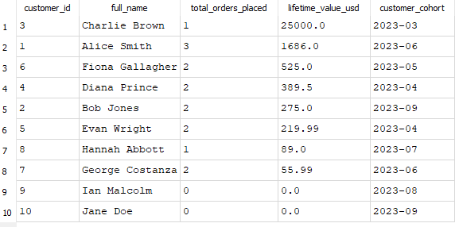

# Shopdata ETL

โปรเจกต์นี้อ่านข้อมูลจาก `shopdata.db` ทำความสะอาดและแปลงข้อมูลด้วย Prefect แล้วบันทึกผลลง `analytics.db`

## วิธีรัน (PowerShell)

เปิด Terminal ในโฟลเดอร์โปรเจกต์ แล้วรันตามลำดับ:

```powershell
py -3.12 -m venv .venv
.\.venv\Scripts\python.exe -m pip install -r requirements.txt
.\.venv\Scripts\python.exe pipeline.py
.\.venv\Scripts\python.exe test_pipeline.py
.\.venv\Scripts\python.exe check_output.py
```

เมื่อ unit test ผ่าน จะเห็น `Ran 3 tests` และ `OK` ส่วน `check_output.py` จะตรวจผลในฐานข้อมูลและแสดง `Tests passed: 10 customers, 17 valid orders`

## ไฟล์ในโปรเจกต์

- `shopdata.db` — ข้อมูลต้นทาง
- `exploration.sql` — SQL ตรวจปัญหาของข้อมูลต้นทาง
- `pipeline.py` — Prefect flow สำหรับอ่าน ทำความสะอาด และบันทึกข้อมูล
- `analytics.db` — ฐานข้อมูลผลลัพธ์ มีตาราง `dim_customers` และ `fct_orders`
- `clv_report.sql` — SQL รายงานมูลค่าลูกค้าตลอดอายุการใช้งาน
- `test_pipeline.py` — ทดสอบการล้างเบอร์โทรศัพท์ การเลือกลูกค้ารายการล่าสุด และการแปลงยอดเงิน
- `check_output.py` — ตรวจจำนวนลูกค้าและออเดอร์ ออเดอร์ที่ยอดเงินไม่ถูกต้อง และยอด USD ของออเดอร์ตัวอย่าง

เปิด `analytics.db` ใน DB Browser for SQLite แล้วนำ SQL ใน `clv_report.sql` ไปรันที่แท็บ Execute SQL เพื่อดูรายงาน
### ตัวอย่างผลรายงาน CLV



รายงานรวมยอด usd_amount ของออเดอร์ที่ยอดเงินมากกว่า 0 แยกตามลูกค้า แล้วเรียงจากมูลค่าสูงสุดลงมา ลูกค้าที่ไม่มีออเดอร์จะแสดงยอด 0 ส่วนยอด 25,000 ของ Charlie Brown มาจากออเดอร์ JPY ที่ไม่พบอัตราแลกเปลี่ยนของวันนั้น จึงใช้อัตรา 1.0 ตามโจทย์

## การทำความสะอาด

- ลูกค้าที่มี `customer_id` ซ้ำ: เก็บรายการที่มี `signup_date` ล่าสุด
- อีเมลว่าง: ใส่ `unknown@domain.com`
- เบอร์โทรศัพท์: เก็บเฉพาะตัวเลข
- ออเดอร์: เก็บเฉพาะรายการที่ `total_amount > 0`
- การแปลงเป็น USD: จับคู่อัตราแลกเปลี่ยนด้วยสกุลเงินและวันที่ออเดอร์
- ออเดอร์ USD ออเดอร์ที่ไม่ระบุสกุลเงิน หรือออเดอร์ที่หาอัตราแลกเปลี่ยนไม่พบ: ใช้อัตรา 1.0

ข้อมูลตัวอย่างหลังรันมีลูกค้า 10 คนและออเดอร์ 17 รายการ ในจำนวนนี้ 2 ออเดอร์ไม่ระบุสกุลเงิน และอีก 5 ออเดอร์หาอัตราแลกเปลี่ยนของวันนั้นไม่พบ จึงใช้อัตรา 1.0 รวม 7 ออเดอร์

## ปัญหาคุณภาพข้อมูลที่พบ

1. ข้อมูลลูกค้ามี 12 แถว แต่มี customer_id ไม่ซ้ำเพียง 10 คน จึงต้องเลือกรายการล่าสุดของลูกค้าแต่ละคน
2. ข้อมูลดิบมีอีเมลว่าง 2 แถว หลังเลือกรายการล่าสุดของลูกค้าแต่ละคน เหลือ 1 คนที่ต้องเติมอีเมล ส่วนเบอร์โทรศัพท์ของลูกค้า 6 คนต้องลบอักขระที่ไม่ใช่ตัวเลข
3. พบออเดอร์ที่ยอดเงินไม่มากกว่า 0 จำนวน 3 รายการ จึงเหลือออเดอร์ที่ใช้ได้ 17 รายการ
4. ออเดอร์ 2 รายการไม่ระบุสกุลเงิน และอีก 5 รายการไม่มีอัตราแลกเปลี่ยนตรงกับวันที่ออเดอร์ จึงใช้อัตรา 1.0 ตามที่โจทย์กำหนด